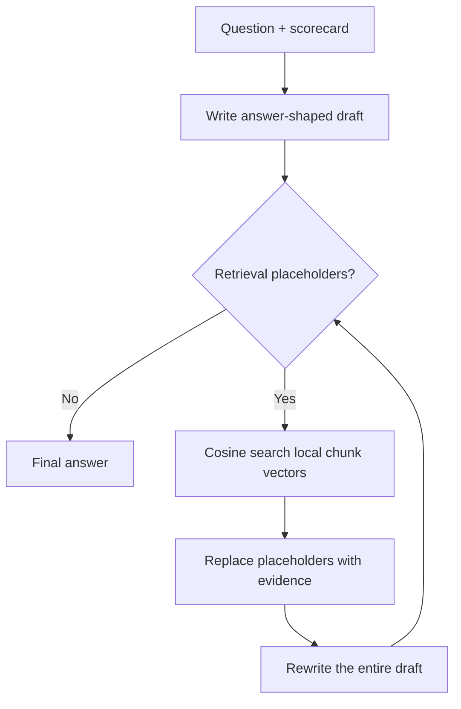

# DraftRAG

### Retrieval requests written inside the answer draft—without a dedicated embedding model

DraftRAG is a small research prototype that explores a different retrieval-augmented
generation loop. Instead of embedding documents and questions with a separate embedding
model, one general-purpose LLM creates an interpretable, corpus-specific semantic
scorecard. The same LLM uses that scorecard to assign vectors to source chunks and to
write vectorized retrieval requests directly inside a draft answer.

The draft is refined repeatedly: retrieve evidence, replace placeholders inline, and
rewrite the entire answer. Generation stops when the LLM produces a draft with no
retrieval placeholders.

> **Status:** experimental proof of concept, not a production RAG replacement.

See the [focused benchmark](benchmarks/README.md) comparing only Azure embedding RAG and
DraftRAG on fictional, version-conflicting, and counterfactual corpora. It measures
on-demand evidence accuracy, context bloat, late discovery, query diversity, and
multi-part answer richness.

The current [canonical DraftRAG validation run](benchmarks/runs/20260826-133715/REPORT.md)
achieved 95.6% claim recall and 83.8% gold-chunk recall with scorecard v3.

## The original idea

Traditional RAG normally performs retrieval before answer generation: chunk documents,
create embeddings with a dedicated model, search the vector index, and then give the
retrieved context to an answer model.

The hypothesis behind DraftRAG is:

> What if retrieval were requested at the exact point where the answer writer discovers
> that evidence is missing?

The first pass receives only the user's question and the generated scorecard. It writes
an answer immediately. Wherever a source fact is needed, it inserts an inline retrieval
placeholder containing both a semantic query and its score vector. Local cosine search
replaces each placeholder with the most relevant source chunks. The next pass rewrites
the whole draft using that evidence and may create new placeholders if it discovers
another information gap. This continues until the answer is complete.

This makes retrieval part of drafting instead of a separate pre-answer orchestration
step.

## How it works

### 1. Generate a corpus-specific scorecard

The LLM examines a sample of the source and defines `N` semantic dimensions. Each
dimension includes an absolute, query-independent definition plus calibrated anchors at
`0.0`, `0.25`, `0.50`, `0.75`, and `1.0`. `N` is configurable and defaults to 10.

`0.0` is reserved for a property that is truly absent or opposed, while `1.0` means the
property is direct and central. Partial values represent weak, meaningful-partial, or
strong-but-incomplete evidence. Missing properties are not given artificial nonzero
scores merely to make a vector dense.

Example dimension families from the included test corpus:

- representation and membership qualifications
- legislative procedure and enactment
- executive powers and appointments
- judicial structure and tenure
- federal-state relations

The complete human-readable and machine-readable definition is stored as
`embedding_rules.md` inside the selected data directory.

### 2. Chunk and index the source

The source is split into chunks. The general LLM scores every chunk from `0.0` to `1.0`
on every scorecard dimension. Chunk text and its resulting vector are saved as
`rag_index.json` inside the selected data directory.

No dedicated embedding endpoint or embedding deployment is called.

### 3. Draft with inline retrieval requests

The first answer pass receives the question and scorecard, but no source chunks. It must
write an answer-shaped draft rather than a search plan. Missing evidence is represented
at the exact point where it is needed:

```text
The deployment requires approval from
[[RETRIEVE: {"query":"after-hours Aster approver for 25 August 2026",
"vector":[1.0,0.8,0.0,0.0,0.0,1.0,0.0,0.0,0.0,0.0]}]].
```

Multiple placeholders may appear in one draft.

### 4. Retrieve, replace, and refine

For every placeholder, DraftRAG:

1. extracts the query and draft-time vector;
2. re-scores the query with the exact prompt used to score source chunks;
3. compares the stabilized query vector with local chunk vectors using cosine similarity;
4. replaces the placeholder with the best matching chunk text;
5. adds unique retrieved chunks to a cumulative evidence bank;
6. asks the LLM to rewrite the complete answer.

If the rewritten draft contains more placeholders, another retrieval pass begins. If it
contains none, that draft becomes the final answer. A configurable pass limit prevents
an infinite loop.



## What "no embedding" means here

DraftRAG does **not** claim to eliminate vectors, indexing, or preprocessing. It removes
the **separate trained embedding model and embedding API**.

The vectors in this experiment are interpretable semantic scorecards generated by the
same general LLM used for drafting. This is closer to LLM-generated feature engineering
than learned dense embeddings. That distinction is important when evaluating the idea.

The draft includes a proposed vector so retrieval intent remains visible inline. The
engine re-scores its query using the same dedicated scoring prompt used during indexing;
this reduces vector drift caused by asking the draft writer to answer and score at once.

## Included experiment

The primary experiment uses `examples/constitution/source.txt`, a plain-text
transcription of the United States Constitution derived from
[Project Gutenberg eBook #5](https://www.gutenberg.org/ebooks/5).
The Project Gutenberg page marks the work public domain in the USA; its publisher preface
and license boilerplate are excluded from the indexed text. Check the applicable law in
your jurisdiction before redistributing source material.

The generated experiment currently contains:

- 10 corpus-specific dimensions;
- 15 paragraph-aware chunks with valid 10-value vectors;
- an Azure OpenAI-only generation path;
- API-free parser, chunking, vector, and cosine tests.

A cross-article stress test asked the system to compare the qualifications and terms of
Representatives, Senators, and the President; explain veto overrides; identify the
appointment roles of the President and Senate; and determine federal judicial tenure.

The run completed in two drafts:

- **Draft 1:** six inline retrieval placeholders;
- **Retrieval:** stabilized query scoring and local cosine search across 15 chunks;
- **Draft 2:** a complete, source-grounded answer with no placeholders.

The earlier two-chunk fictional Project Aster corpus remains available as
`examples/aster/source.txt` for a faster, cheaper smoke test.

Browse the [examples directory](examples/README.md), or see the complete
[Constitution example](examples/constitution/README.md), including the
[recorded two-draft iteration](examples/constitution/iteration.md), source snapshot,
generated scorecard, and 15-chunk index.

## Requirements

- Python 3.10 or later
- An Azure OpenAI deployment that supports the Responses API
- No Python packages are required

Copy `.env.example` to `.env`, then add your Azure values:

```bash
cp .env.example .env
```

`.env` is loaded automatically and excluded by `.gitignore`.
`AZURE_OPENAI_EMBEDDING_DEPLOYMENT_NAME` is optional for the main prototype and enables
the standard embedding-RAG baseline in `benchmarks/benchmark.py`.

## Quick start

```bash
# 1. Generate N corpus-specific scoring dimensions
python3 no_emb_rag.py --data-dir examples/constitution init \
  examples/constitution/source.txt --dimensions 10

# 2. Create exactly 15 chunks for this source and score the local index
python3 no_emb_rag.py --data-dir examples/constitution index \
  examples/constitution/source.txt --max-chars 2100

# 3. Ask a question and display every draft pass
python3 no_emb_rag.py --data-dir examples/constitution ask --top-k 3 --trace \
  "Compare the qualifications and terms of Representatives, Senators, and the President."
```

Useful options:

```bash
# Retrieve one chunk per placeholder and allow at most five drafts
python3 no_emb_rag.py --data-dir examples/constitution ask \
  --top-k 1 --max-passes 5 --trace "Your question"

# Run tests that do not call Azure OpenAI
python3 no_emb_rag.py self-test
```

## Files

| File | Purpose |
| --- | --- |
| `no_emb_rag.py` | Complete prototype: Azure client, prompting, indexing, retrieval, and refinement |
| `examples/` | Every source document, generated artifact, and iteration trace |
| `benchmarks/` | Three 60-chunk synthetic corpora, baselines, gold questions, and recorded pilot results |
| `.env.example` | Safe Azure OpenAI configuration template |
| `.env` | Private Azure OpenAI configuration; never commit this file |

The generated rules and index are included for reproducibility of the example. Regenerate
both when changing the source corpus or dimension count.

Older checked-in examples record the original endpoint-only scorecard prompt. Run `init`
and `index` again to use the absolute five-anchor scorecard and index-collapse checks.

## Why this might be interesting

- **Retrieval follows the evolving answer.** Queries are created when and where an
  information gap appears during drafting.
- **Multiple retrieval needs emerge naturally.** One draft can request independent facts
  for different parts of the answer.
- **Dimensions are inspectable.** Each vector coordinate has a written meaning rather
  than being an opaque learned feature.
- **The schema can adapt to a corpus.** A policy handbook and a product catalog can use
  different semantic axes.
- **Later passes can discover new gaps.** Retrieval is not limited to a single initial
  query-rewrite step.

## Limitations and open questions

- LLM-generated scores may vary between runs and models.
- Ten hand-designed dimensions have far less representational capacity than modern dense
  embeddings.
- Creating the index requires one LLM scoring call per chunk in this minimal version.
- Corpus-specific dimensions may not generalize to unrelated questions or new documents.
- Mixed-topic queries can blur multiple dimensions; retrieving more than one chunk may
  be safer.
- The model may stop too early, request unnecessary evidence, or repeat a retrieval need.
- Prompt placeholders are parsed from text and need stronger validation for production.
- Changing the scorecard requires re-scoring every chunk.
- Retrieval quality, latency, token use, and cost must be evaluated against BM25 and
  embedding-based RAG baselines.

Useful future experiments include deterministic structured output, batched chunk scoring,
hybrid lexical search, query deduplication, evidence citations, per-placeholder evidence
isolation, convergence detection, and a benchmark comparing answer faithfulness and
retrieval recall.

## Suggested repository metadata

- **Repository name:** `draft-rag`
- **Description:** `Iterative RAG where the LLM writes inline retrieval requests while drafting—without a dedicated embedding model.`
- **Topics:** `rag`, `llm`, `retrieval-augmented-generation`, `iterative-retrieval`,
  `azure-openai`, `semantic-search`, `research-prototype`

## Contributing

This project is intentionally small so the retrieval loop is easy to inspect. Issues,
failure cases, alternative scoring schemes, and benchmark results are welcome. When
reporting a result, include the generated scorecard, model deployment, chunk size,
`top-k`, maximum pass count, and full draft trace.
